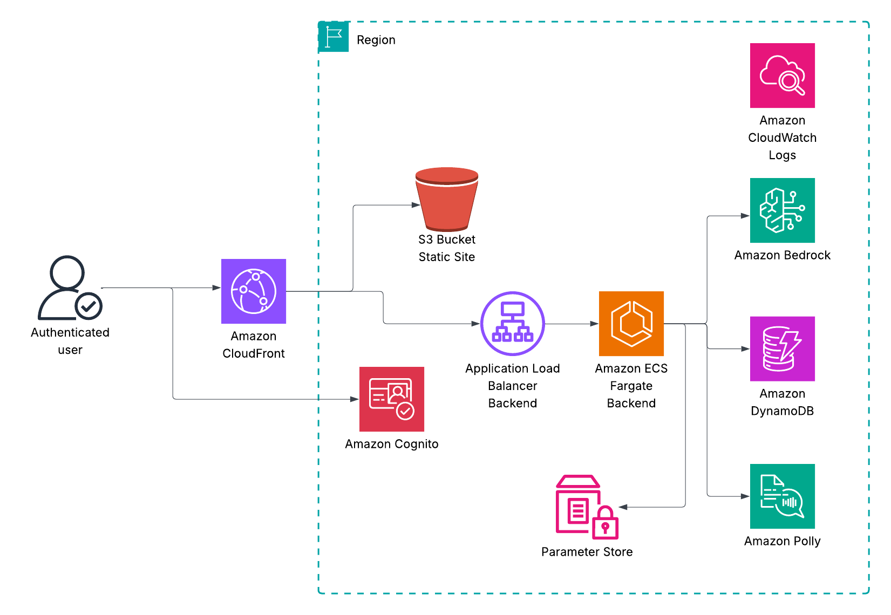

# Group Chat AI - System Architecture  

> • 🇺🇸 **This document is also available in:** [English](#)
> • 🇸🇦 **هذا المستند متوفر أيضاً بـ:** [العربية](./docs/ar/ARCHITECTURE_ar.md)
> • 🇩🇪 **Dieses Dokument ist auch verfügbar in:** [Deutsch](./docs/de/ARCHITECTURE_de.md)
> • 🇪🇸 **Este documento también está disponible en:** [Español](./docs/es/ARCHITECTURE_es.md)
> • 🇫🇷 **Ce document est également disponible en:** [Français](./docs/fr/ARCHITECTURE_fr.md)
> • 🇮🇱 **מסמך זה זמין גם ב:** [עברית](./docs/he/ARCHITECTURE_he.md)
> • 🇮🇹 **Questo documento è disponibile anche in:** [Italiano](./docs/it/ARCHITECTURE_it.md)
> • 🇯🇵 **この文書は以下の言語でもご利用いただけます:** [日本語](./docs/ja/ARCHITECTURE_ja.md)
> • 🇰🇷 **이 문서는 다음 언어로도 제공됩니다:** [한국어](./docs/ko/ARCHITECTURE_ko.md)
> • 🇳🇱 **Dit document is ook beschikbaar in:** [Nederlands](./docs/nl/ARCHITECTURE_nl.md)
> • 🇵🇹 **Este documento também está disponível em:** [Português](./docs/pt/ARCHITECTURE_pt.md)
> • 🇷🇺 **Этот документ также доступен на:** [Русский](./docs/ru/ARCHITECTURE_ru.md)
> • 🇸🇪 **Detta dokument är också tillgängligt på:** [Svenska](./docs/sv/ARCHITECTURE_sv.md)
> • 🇨🇳 **本文档还提供以下语言版本:** [中文](./docs/zh/ARCHITECTURE_zh.md)


  ## Overview  
    
  Group Chat AI is a sophisticated real-time conversational AI platform that enables users to engage in collaborative discussions with multiple AI personas. The system leverages AWS cloud services to deliver a scalable, secure, and performant solution with real-time voice and text interactions for group conversations.  
    
  ## Architecture Diagrams  
    
  ### High-Level System Architecture  
    

    
  ## System Components  
    
  ### 1. Frontend Layer  
    
  #### **CloudFront Distribution**  
  - **Purpose**: Global content delivery network for optimal performance  
  - **Features**:  
    - Static asset caching (React application build)  
    - API request routing to backend ALB  
    - WebSocket connection proxying for real-time communication  
    - Geo-restriction and security policies  
    - Custom domain support with ACM certificates  
    
  #### **S3 Static Hosting**  
  - **Purpose**: Serves the React application build artifacts  
  - **Content**:   
    - HTML, CSS, JavaScript bundles  
    - Static assets (images, fonts, localization files)  
    - Dynamic configuration files (config.json for environment-specific settings)  
    
  #### **React Frontend Application**  
  - **Technology**: React 18 with TypeScript, Vite build system  
  - **Features**:  
    - Real-time WebSocket communication  
    - Voice input/output capabilities  
    - Multi-language internationalization  
    - Responsive design with modern UI components  
    - Image upload and processing  
    
  ### 2. Authentication & Authorization  
    
  #### **Amazon Cognito User Pool**  
  - **Purpose**: Centralized user authentication and management  
  - **Features**:  
    - OAuth 2.0 / OpenID Connect integration  
    - Email-based registration and verification  
    - Password policies and account recovery  
    - Integration with frontend via OIDC flow  
    
  #### **User Pool Client**  
  - **Configuration**:   
    - Authorization Code Grant flow  
    - Callback URLs for development and production environments  
    - Scopes: openid, email, profile  
    - Token validity periods optimized for security  
    
  ### 3. Network Infrastructure  
    
  #### **VPC (Virtual Private Cloud)**  
  - **Design**: Multi-AZ deployment for high availability  
  - **Subnets**:  
    - **Public Subnets**: Host ALB and NAT Gateway  
    - **Private Subnets**: Host ECS Fargate tasks for security  
    
  #### **Application Load Balancer (ALB)**  
  - **Purpose**: HTTP/HTTPS traffic distribution and SSL termination  
  - **Security**: **CRITICAL - ALB accepts traffic ONLY from CloudFront IP ranges**  
  - **Features**:  
    - Health checks for ECS services  
    - Path-based routing (/api/* → backend, /ws/* → WebSocket)  
    - Security groups configured with CloudFront managed prefix lists  
    - Access logging to S3  
    - **All user traffic (HTTP/WebSocket) must flow through CloudFront**  
    
  ### 4. Backend Services (ECS Fargate)  
    
  #### **Express.js Application Server**  
  - **Runtime**: Node.js 20 with TypeScript  
  - **Architecture**: Microservices-oriented design  
  - **Core Components**:  
    - REST API endpoints for session management  
    - WebSocket server for real-time communication  
    - Middleware for logging, error handling, and security  
    
  #### **Core Service Components**  
    
  ##### **ConversationOrchestrator**  
  - **Purpose**: Central coordinator for AI conversations  
  - **Responsibilities**:  
    - Message routing and persona selection  
    - Audio queue management for natural conversation flow  
    - Real-time response streaming  
    - Iterative conversation management  
    
  ##### **PersonaManager & PersonaAgent**  
  - **Purpose**: Manages AI persona definitions and behaviors  
  - **Features**:  
    - Custom persona creation and management  
    - Persona-specific conversation contexts  
    - Dynamic persona selection based on content analysis  
    
  ##### **RoutingAgent**  
  - **Purpose**: Intelligent routing of user messages to appropriate personas  
  - **Technology**: Uses Amazon Bedrock for decision-making  
  - **Features**:  
    - Content analysis and persona relevance scoring  
    - Conversation continuation logic  
    - Multi-persona interaction orchestration  
    
  ##### **SessionService**  
  - **Purpose**: Manages user sessions and conversation state  
  - **Features**:  
    - Session lifecycle management  
    - Conversation history persistence  
    - User-specific customizations  
    
  ##### **WebSocket Management**  
  - **Components**: WebSocketServer, WebSocketController, SessionWebSocketManager  
  - **Features**:  
    - Real-time bidirectional communication  
    - Session-specific WebSocket connections  
    - Audio streaming and acknowledgment protocols  
    
  ### 5. AI/ML Services Integration  
    
  #### **Amazon Bedrock**  
  - **Models**: Claude 4 (us.anthropic.claude-sonnet-4-20250514-v1:0)  
  - **Usage**:  
    - Conversation generation for AI personas  
    - Content analysis and routing decisions  
    - Context-aware response generation  
  - **Configuration**: Via Parameter Store for environment-specific settings  
    
  #### **Amazon Polly**  
  - **Purpose**: Text-to-speech conversion for voice interactions  
  - **Features**:  
    - Multiple voice options with persona-specific assignments  
    - Newscaster speaking style for certain personas  
    - Streaming audio synthesis  
    - Language-aware voice selection  
    
  ### 6. Configuration & Monitoring  
    
  #### **AWS Systems Manager Parameter Store**  
  - **Purpose**: Centralized configuration management  
  - **Parameters**:  
    - LLM model and provider settings  
    - Cognito configuration details  
    - Environment-specific settings  
    
  #### **CloudWatch Logs & Metrics**  
  - **Features**:  
    - Centralized logging for all services  
    - Performance metrics and monitoring  
    - Error tracking and alerting  
    - Custom metrics for AI service usage  
    
  ## Data Flow Patterns  
    
  ### 1. User Authentication Flow  
  ```  
  User → CloudFront → Cognito User Pool → OAuth Flow → JWT Token → API Calls  
  ```  
    
  ### 2. Real-time Conversation Flow  
  ```  
  User Message → WebSocket (via CloudFront) → ALB → ConversationOrchestrator → RoutingAgent → PersonaAgent → Bedrock → Response → Polly → Audio Stream → WebSocket (via CloudFront) → User  
  ```  
    
  ### 3. AI Processing Pipeline  
  ```  
  User Input → Content Analysis → Persona Selection → Context Building → LLM Request → Response Generation → Audio Synthesis → Queue Management → Delivery  
  ```  
    
  ## Security Architecture  
    
  ### Network Security  
  - **WAF Integration**: CloudFront-integrated Web Application Firewall  
  - **VPC Security**: Private subnets for backend services  
  - **Security Groups**: Least-privilege access control  
  - **ALB Restrictions**: CloudFront IP range limitations  
    
  ### Data Security  
  - **Encryption in Transit**: HTTPS/TLS everywhere  
  - **Encryption at Rest**: S3 and Parameter Store encryption  
  - **Secrets Management**: Parameter Store for sensitive configuration  
  - **Access Control**: IAM roles with minimal permissions  
    
  ### Application Security  
  - **Authentication**: Cognito-based OAuth 2.0/OIDC  
  - **Authorization**: JWT token validation  
  - **Input Validation**: Comprehensive request validation  
  - **Rate Limiting**: API and WebSocket connection limits  
    
  ## Scalability & Performance  
    
  ### Auto Scaling  
  - **ECS Service**: CPU and memory-based auto scaling (1-10 tasks)  
  - **ALB**: Automatic scaling based on traffic  
  - **CloudFront**: Global edge locations for CDN  
    
  ### Performance Optimizations  
  - **Caching**: CloudFront caching for static assets  
  - **Audio Streaming**: Base64 data URLs for immediate playback  
  - **Connection Pooling**: Efficient WebSocket connection management  
  - **Lazy Loading**: On-demand service initialization  
    
  ### High Availability  
  - **Multi-AZ Deployment**: VPC spans multiple availability zones  
  - **Health Checks**: ALB health monitoring for ECS services  
  - **Graceful Degradation**: Fallback mechanisms for service failures  
    
  ## Technology Stack Summary  
    
  ### Frontend  
  - **Framework**: React 18 with TypeScript  
  - **Build Tool**: Vite  
  - **Styling**: Modern CSS with responsive design  
  - **State Management**: React Context API  
  - **Authentication**: OIDC Client  
  - **Real-time**: WebSocket API  
    
  ### Backend  
  - **Runtime**: Node.js 20  
  - **Framework**: Express.js  
  - **Language**: TypeScript  
  - **WebSocket**: ws library  
  - **Logging**: Winston  
  - **Testing**: Jest  
    
  ### Infrastructure  
  - **Orchestration**: AWS CDK (TypeScript)  
  - **Compute**: ECS Fargate  
  - **Storage**: S3  
  - **CDN**: CloudFront  
  - **Database**: In-memory state management  
  - **Configuration**: Parameter Store  
    
  ### AI/ML  
  - **LLM**: Amazon Bedrock (Claude 4)  
  - **TTS**: Amazon Polly  
  - **Content Analysis**: Custom service with LLM integration  
    
  ## Deployment Architecture  
    
  ### Environment Strategy  
  - **Development**: Local development with backend port 3000  
  - **Production**: CDK-deployed infrastructure with CloudFront  
    
  ### CI/CD Pipeline  
  - **Frontend**: Vite build → S3 deployment → CloudFront invalidation  
  - **Backend**: Docker build → ECR → ECS service update  
  - **Infrastructure**: CDK diff → Deploy → Verification  
    
  ### Configuration Management  
  - **Environment Variables**: Container-level configuration  
  - **Secrets**: Parameter Store integration  
  - **Feature Flags**: Environment-based enablement  
    
  ## Monitoring & Observability  
    
  ### Logging Strategy  
  - **Centralized**: All logs flow to CloudWatch  
  - **Structured**: JSON-formatted log entries  
  - **Correlation**: Request IDs for tracing  
  - **Levels**: Debug, Info, Warn, Error classification  
    
  ### Metrics & Alarms  
  - **Application Metrics**: Response times, error rates  
  - **Infrastructure Metrics**: CPU, memory, network utilization  
  - **Business Metrics**: Conversation completion rates, persona usage  
  - **Custom Alarms**: Proactive issue detection  
    
  ### Health Monitoring  
  - **Health Endpoints**: /health for service status  
  - **Dependency Checks**: External service connectivity  
  - **Graceful Degradation**: Fallback behavior monitoring  
    
  ## Future Architecture Considerations  
    
  ### Scalability Enhancements  
  - **Database Integration**: Consider RDS for persistent storage  
  - **Caching Layer**: Redis/ElastiCache for session state  
  - **Microservices**: Further service decomposition  
    
  ### AI/ML Improvements  
  - **Model Fine-tuning**: Custom model training  
  - **A/B Testing**: Multiple model comparison  
  - **Conversation Analytics**: Advanced usage insights  
    
  ### Security Enhancements  
  - **WAF Rules**: Enhanced attack protection  
  - **API Gateway**: Consider migration for advanced features  
  - **Compliance**: SOC 2, GDPR considerations  
    
  This architecture provides a robust, scalable, and secure foundation for the Group Chat AI platform while maintaining flexibility for future enhancements and growth.  
  